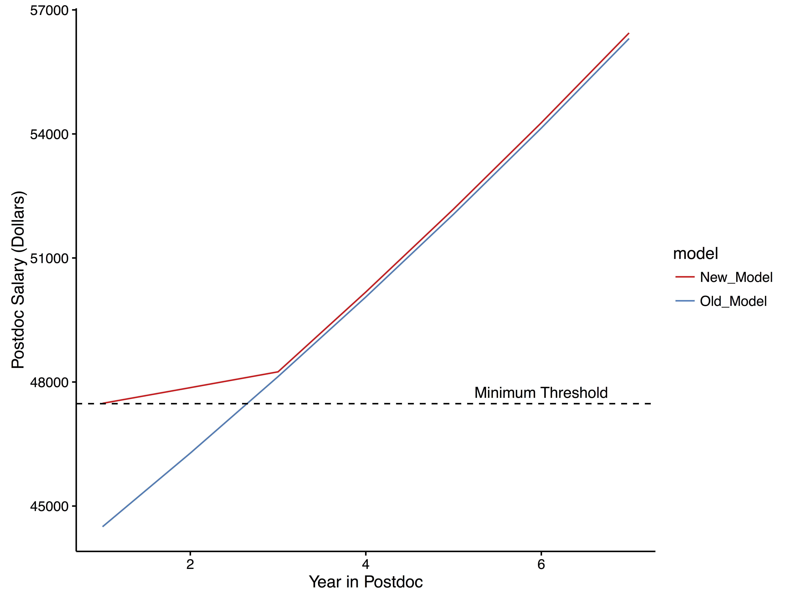

# NihPostdocSalary
A simple visualization of the new postdoc salary model for 2017.

# Results
All I did here was recreate what the old model would have looked like for 2017, and compared it to the new model that will actually be used in 2017. In the old model, the salary would have started lower but risen at a constant rate of 4% each year. In the new model, the salary hangs with a minimal increase of 0.8% for the first two years, and then resumes a 4% increase from the third year on.

There are a couple of points we can take away from this visualization. *First*, the new threshold is right on the governmant mandated minimum. *Second*, once you have a couple of postdoc years of experience, it really doesn't matter. You pick up right where you would have been. *Finally*, this does benefit actually benefit postdocs in their early stages. The higher starting rate means that young postdocs will have accumulated more total cash.

# Further Reading
Check out [this nice article](http://www.sciencemag.org/careers/2016/08/nih-sets-new-postdoc-stipend-levels?utm_content=34891413&utm_medium=social&utm_source=facebook) in Science.

Check out the [NIH Documentation](https://grants.nih.gov/grants/guide/notice-files/NOT-OD-16-131.html) for even more information.

# Data Collection

These two sources above were also where I looked to get my data. 

The percent increases are outlined in the Science Article and agreed with NIH records. I started the salary of the old model as an estimate based on how the previous years have increased, and the 4% icnrease from there was pretty standard. Check out the source code for the details.
